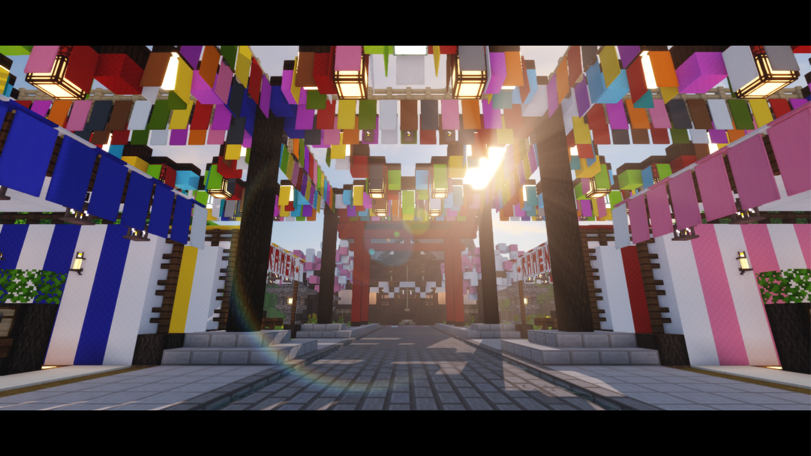

## 初桜神社

初桜神社为目前夜桜社生存世界出生点。

于2020/1/26日实装，坐标为`(-5123,67,-1432)`。

- 神社两侧设有两块留言板。
- 神社前方设有小型祭典市场。
- 祭典市场之外则是夜桜铁路总站。
- 神社内供奉着樱花。

*拍摄使用光影：projectLUMA 使用材质:xKer 方纹淡彩*
## 祭典市场

祭典市场为初桜神社前的一条住民商业区。

此处摊位可以随意改造使用用于开设箱子商店。

不设租金，对于无货箱子会**不定期进行清理**

## 夜桜铁路总站

由住民*天姫* `Tenkijino`发起的交通枢纽修建。

总站下是未完工的冰道地铁。

铁路线铺设目前存在许多问题，施工进度缓慢。