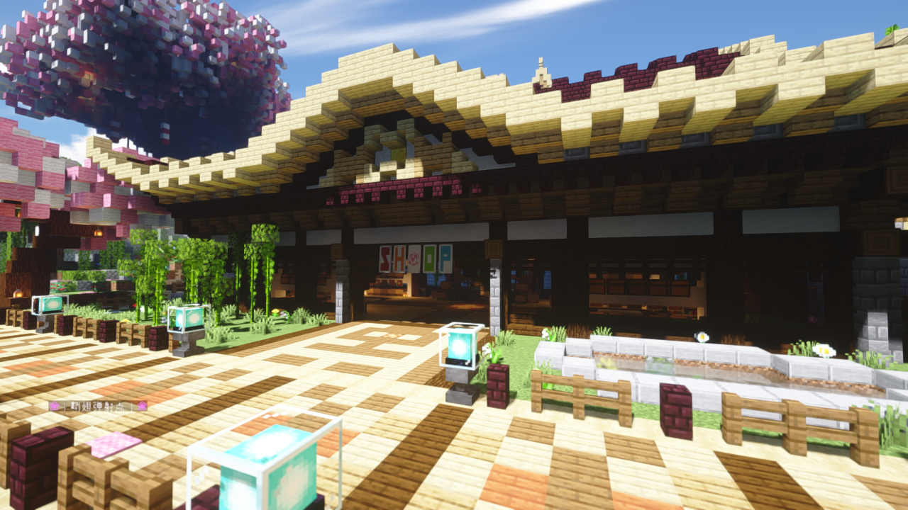
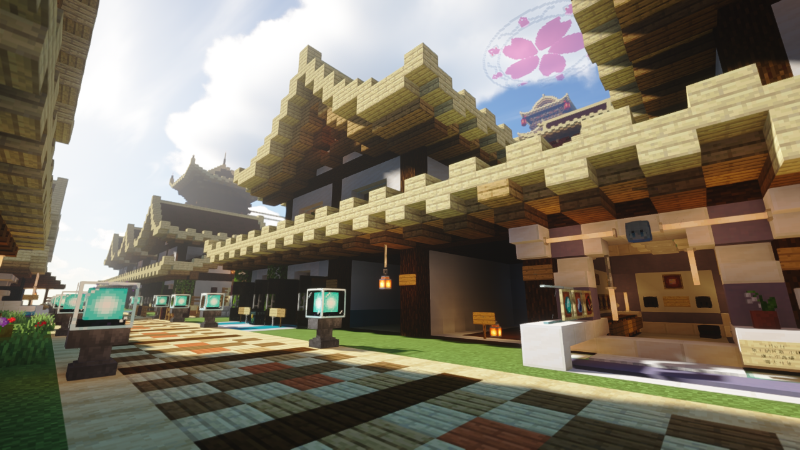
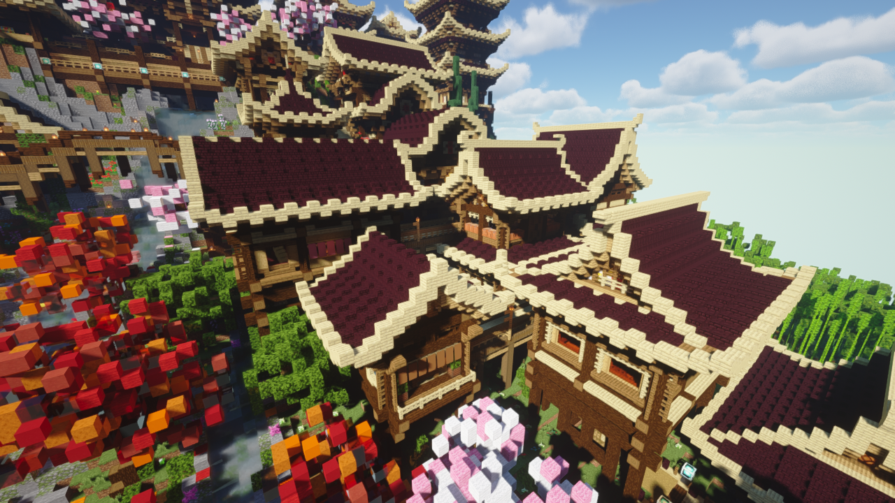
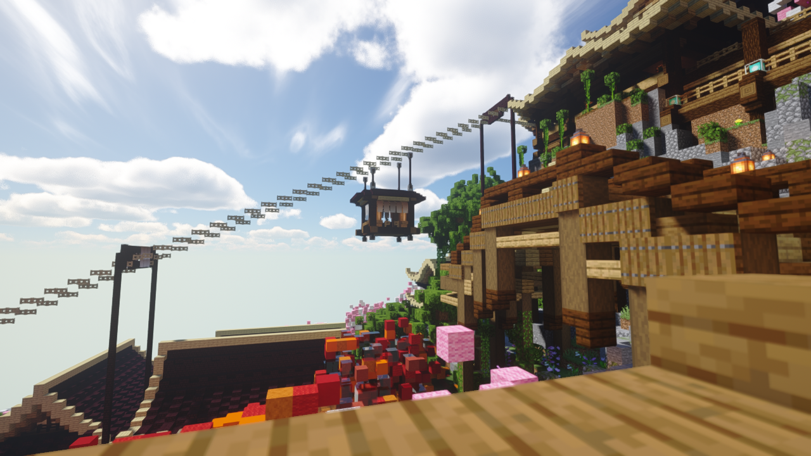
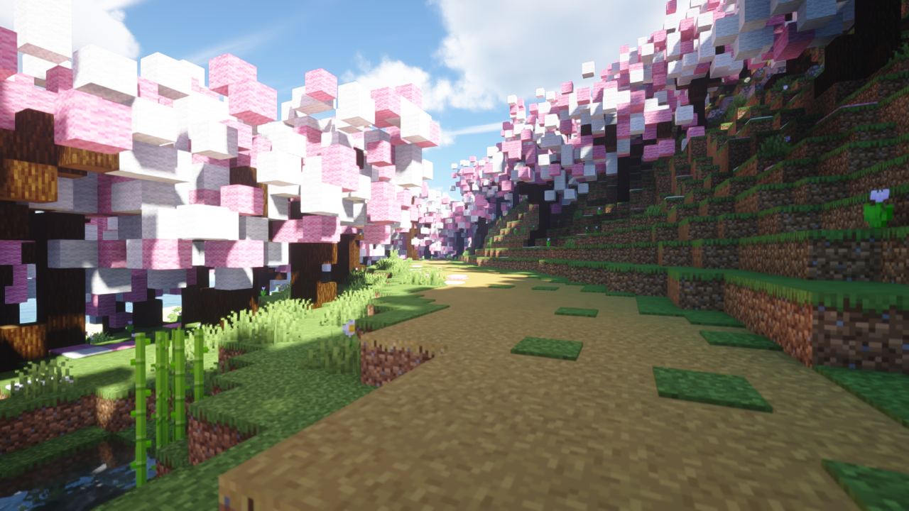
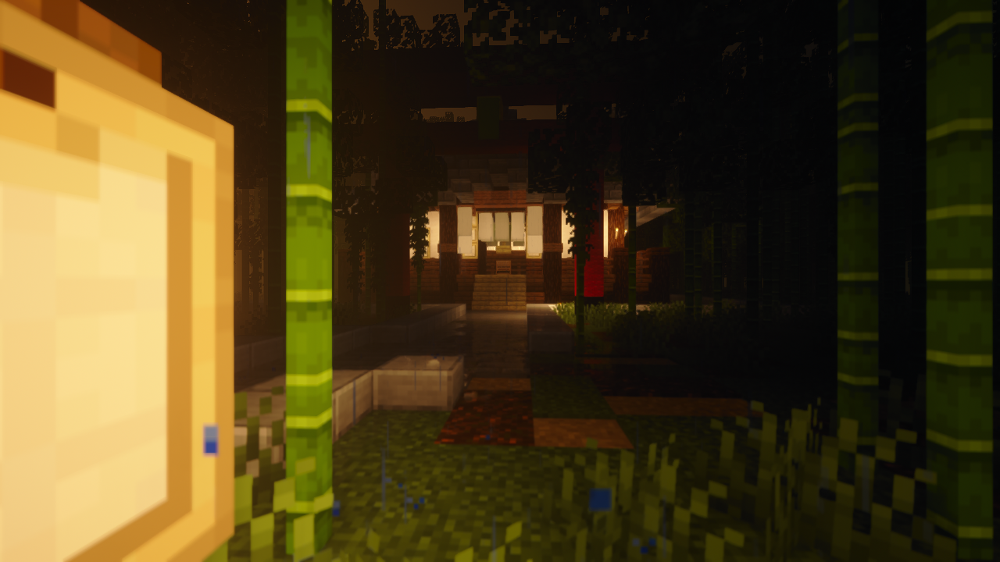

# 夜桜岛

**建造者**:*天姫* `Tenkijino`

夜桜岛为2020/3/9更新的夜桜社新主城。  
旧主城原址仍在，需要通过指令`/mvtp world`前往。旧主城已失去所有原有功能，只作为纪念留下。~~同时是地狱门储存仓库~~  
~~夜桜岛境内不会生成任何**敌对生物**~~。目前有袭击发生目击报道。

## 主殿

每一位夜桜社住民初次来到这个世界都会诞生于此。

主殿顶端有夜桜社的标志


*使用拍摄光影：BSL Shader*

## 系统商店

作为夜桜社内经济的始发点，大部分住民的第一桶金源自此处。

商店内的价格会不定期发生调整，目前为商店资源为无限。

!> 无限设定可能会在将来发生变化。


*使用拍摄光影：iterationT Next Hotfix*

## 夜桜商店街

作为夜桜社官方提供的供住民们使用的商业地带，这里是开店的好去处。

如果需要使用店铺，你只需要前往[服务器论坛](https://bbs.9sakura.com/)发帖登记即可。  
商铺租费`15000游戏币/2月`

发帖示例：

```
商铺租用
门牌号：A-3
ID：Tenkijino
主要出售：附魔书，建材等。
货源稳定度：良好
```


*使用拍摄光影：iterationT Next Hotfix*

## NPC商店区

为了让住民们有更加便捷的物资来源，夜桜岛设立了许多NPC来帮助出售批量货物。

这里同时也是岛内路线最绕的地方，初来者很容易迷路。

因此在每个商店皆设有传送木牌来帮助住民进行便捷的移动。


*使用拍摄光影：iterationT Next Hotfix*

## 樱花索道

从主殿能快速抵达商业街的交通方式。~~传送牌子更快~~

缆车内部需要使用鞘翅飞入，在缆车内坐着歇息一会也是一种不错的选择！


*使用拍摄光影：iterationT Next Hotfix*

## 樱花小径

位于岛西边的一处樱花山谷，种满了大量的樱花树，与商业街相连。


*使用拍摄光影：iterationT Next Hotfix*

## 竹林神社

位于岛东边的竹林内的小型神社，供奉着苦力怕神。

奉纳可以保佑不会被苦力怕炸噢！~~并没有用~~


*使用拍摄光影：iterationT Next Hotfix*
