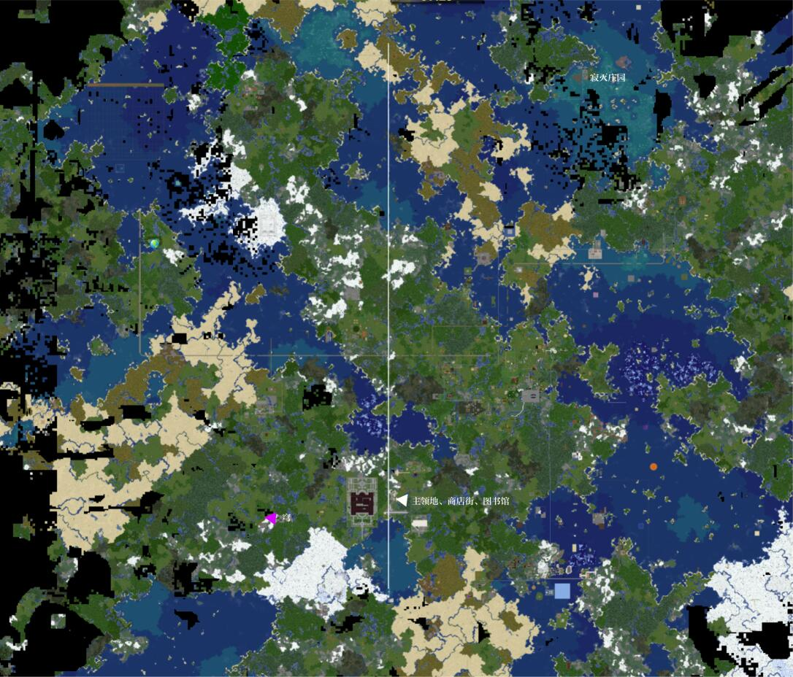
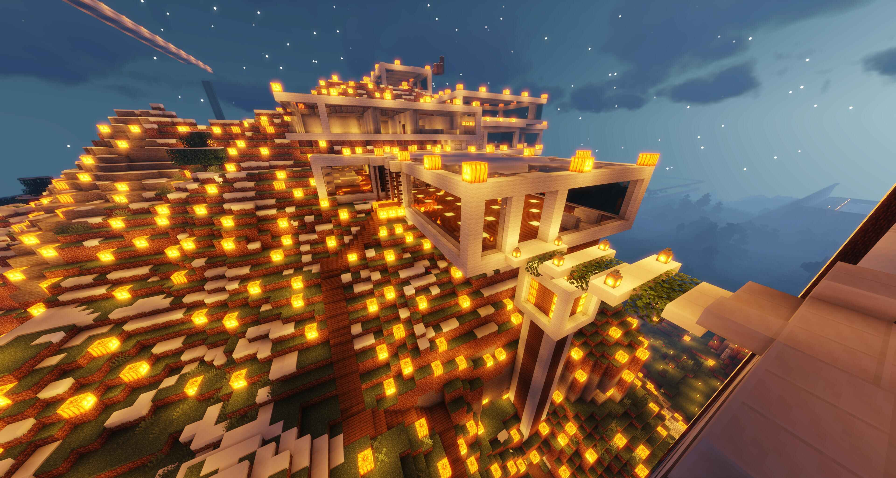
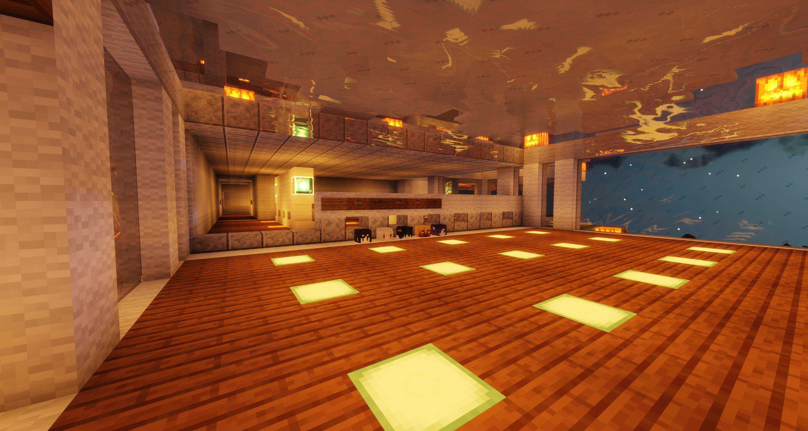
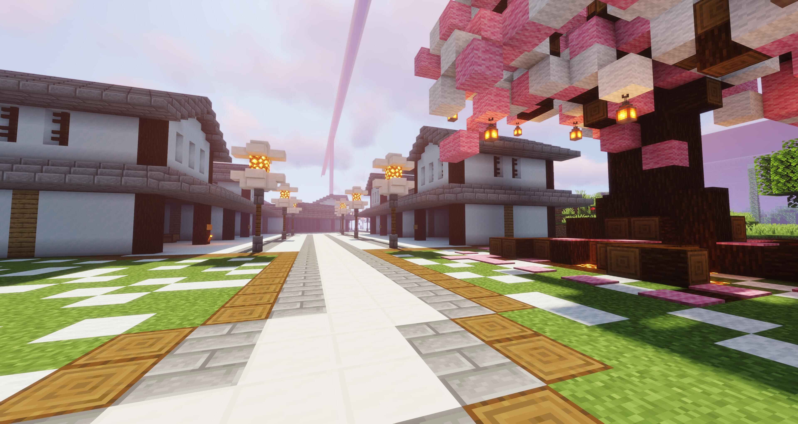
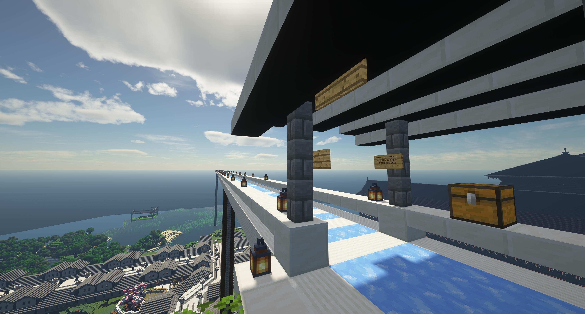
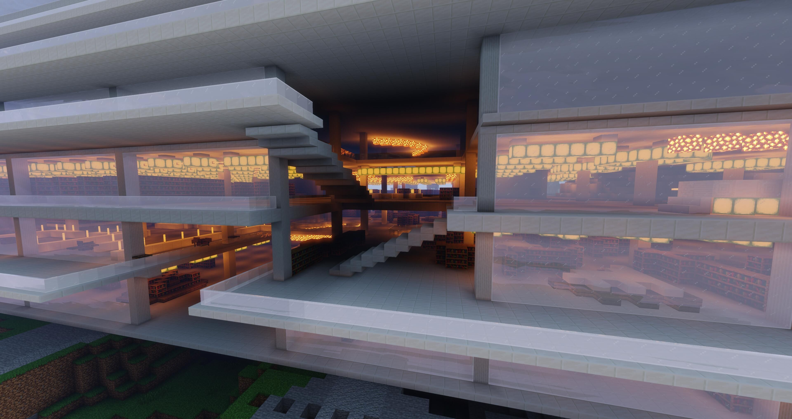
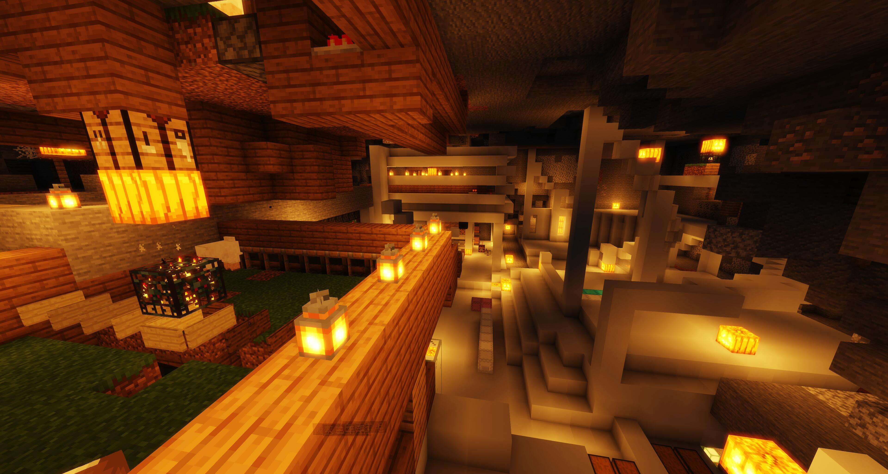
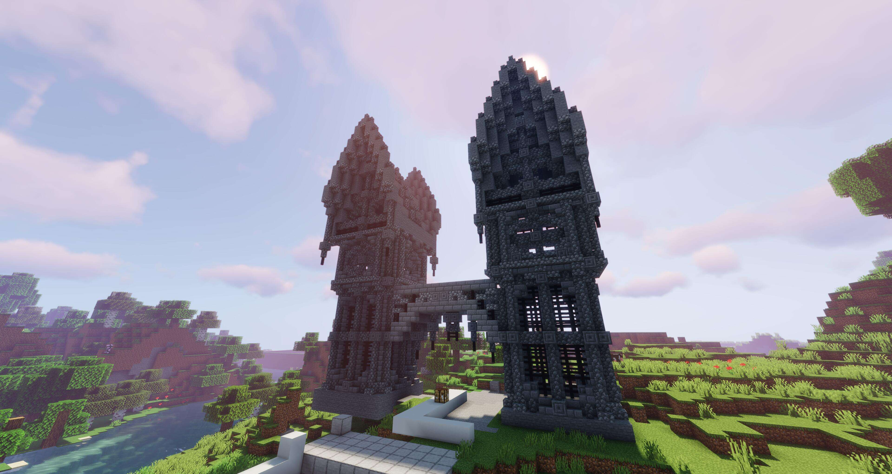
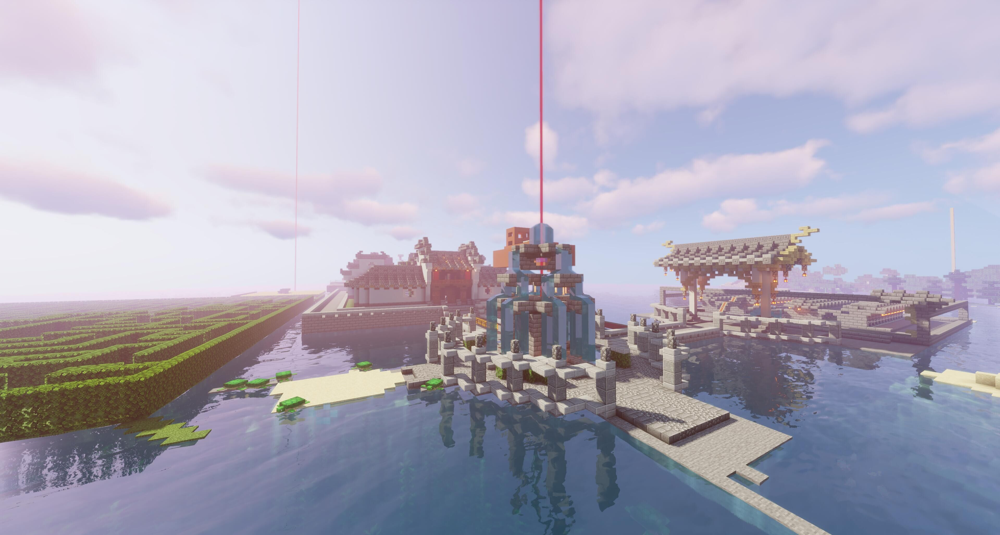
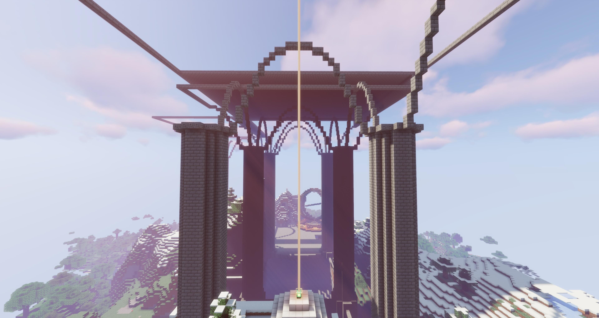

# 雪夜镇

**安宁于冰雪之地的白色小镇**

!> 雪夜镇主领地“Zi_You”开启白名单（move权限），这意味着您无法使用/warp xyz、/res tp Zi_You、/z等方法到达雪夜镇

!> 您可以向在线的相关人员（雪夜镇成员、吉祥物和服务器管理员）询问，以获得雪夜镇的暂时白名单。  
您还可以与种子Zi_You联系，种子Zi_You会在审核后给予您雪夜镇主领地的永久白名单。

## 关于雪夜镇

### 高度资源共享

高度：基本所有方面。  
资源：物品、领地、经济、劳动力。  
共享：基于信任的共享，可以说是互相赠送。  

### 他们每个人都是主人

各种喜欢自然风光、喜欢散居的玩家，  
在服务器各种各样的地形圈地、发展，  
最终，他们聚集到了一起。  
他们每个人都是自己领地的主人，  
他们每个人都是雪夜镇的主人。  
你可以招呼任何一个人帮忙修建你的建筑，  
你也乐意帮助其他居民修建他们的建筑。  

### 强大的后勤系统（x

强大的供应链满足你的生存与建筑需求。

### 遍布整个地图

拥有总价值超过$2000w的领地。  
拥有一条超长的蓝冰高铁（图中白线）。  

### 慈善事业

雪夜镇成员的强大经济实力支持了雪夜镇慈善事业的发展。  
具体体现在主城玩家商店的不定量收购绯樱物品。  
我们支持萌新度过一个靠自己的努力逐渐富有的前期，  
并为他们提供了一条线路：肝绯樱怪。  
该收购项目与相关出售项目一直处于亏损状态。  
时不时招收的苦力工作也给萌新了一个发家致富的道路。 

*据说 **种子** `Zi_You`有一次招收苦工工薪达到了50w/h，且任务十分简单（铺地板）。*

### 养老~~（咕咕咕~~

由于居民人数不多、工程量巨大、居民现实生活中学业繁重，  
许多工程都处于半成品状态。  
偶尔上线也只会挂挂机、清理一下商店……下  

### 和谐友好的佛系小镇

各个小镇居民在经历了各种各样的事情之后变得佛系了起来……  
我们坚信友善的态度可以解决任何问题。  
这不仅是对外的态度，也是对内的态度。  
雪夜镇居民的关系是朋友关系，而不是邻居关系。  

###  风格各异

雪夜镇没有统一的风格，  
这意味着你可以随心所欲的发挥。  

## 雪夜镇相关人员

雪夜镇由于极高的门槛以及并不是太大的受众（散居玩家）  
而获得了一个较为稳定的居民名单。  

**居民：**

- *种子* `Zi_You`（镇长）  
- `LuiluiArubatorion`  
- `Hugh_mr`  
- `Jesse`  
- *二马* `XHETXIEE`  

**吉祥物：**

- *立华奏* `ItsKanade`  
- *弥风* `awsl_mifeng`  
- *夜白* `wastewood`  

理论上相关人员都有雪夜镇各个领地的权限，您可以询问他们来获得雪夜镇的暂时move权限。

## 雪夜镇风光

### 雪夜镇主领地（雪夜山）

*使用拍摄光影：Sildurs Vibrant Shaders v1.27 Extreme-VL*

这里的居民总是尝试着用温暖的心灵来抵御雪的寒冷，  
这里的居民总是尝试着用明亮的灯光来驱散夜的孤寂，  
即使分居世界各地，也不忘回家看看，  
即使处在永远的夜晚中，也尝试用南瓜灯点亮每一寸土地。  

### 雪夜公寓

*使用拍摄光影：Sildurs Vibrant Shaders v1.27 Extreme-VL*

### 雪夜商业街

*使用拍摄光影：Sildurs Vibrant Shaders v1.27 Extreme-VL*

冷清的商店街，在等待着炽热来临。  

### 雪夜高铁

*使用拍摄光影：SEUS_PTGI_E12*

雪白的铁路连接着雪夜镇的各个区域，也拉近了各个居民的距离。

### 雪夜图书馆（在建）

*使用拍摄光影：Sildurs Vibrant Shaders v1.27 Extreme-VL*

建筑：*种子* `Zi_You`  
全服最贵的建筑，造价高达1500w（仅仅计算物品价值以及领地价值）。  
现因为种子学业繁忙，咕咕咕。  

### 雪夜地下城（禁地）

*使用拍摄光影：Sildurs Vibrant Shaders v1.27 Extreme-VL*

据说这个地方一启动，全服都要卡三秒。
受到了管理员的**特别关心**。

### 门（与隔壁小镇的门，隔壁小镇尚未命名，门也尚未命名）

*使用拍摄光影：Sildurs Vibrant Shaders v1.27 Extreme-VL*

建筑：`Jesse`  
不要问为什么这玩意风格跟图书馆截然不同，Jesse不知道，种子也不知道……  

### 寂灭山庄

*使用拍摄光影：Sildurs Vibrant Shaders v1.27 Extreme-VL*

建筑：`Jesse`  

### 穹（在建）

*使用拍摄光影：Sildurs Vibrant Shaders v1.27 Extreme-VL*

建筑：`XHETXIEE`  
也是因为学业繁忙而咕咕咕的工程  

## 加入我们

如果你喜欢游山玩水，对群居生活感到烦闷，  
或是想要在荒郊野外整点规模较大的建筑，  
或是想要在服务器里结交各种朋友，  
尝试加入我们吧！  

### 加入我们可以获得什么？

其实我们的共享并不像你想得那样随性……  
加入我们不像其他小镇那样可以获得各种补助，  
你在这里能获得的只有来自所有居民的信任。  

### 雪夜镇的门槛非常高

其理由是希望如此筛选出来的玩家值得寄予我们的信任。  

我们要求您必须在加入雪夜镇之前在服务器中就具有一定的**影响力**与**话语权**。  

?> ❕ 这并不需要您有多少现金，更不需要您缴纳多少现金。

**我们的评判标准如下**：

若您完全不精通红石与建筑，您至少需要300w资产。  

**其中包括**：  
- 持有物品价值（绝版物品往往拥有更大的价值）
- 现金
- 建筑价值
- 政治资产（与服务器其他人的友好关系）
- 您对服务器的喜爱程度
- 您的活跃时间以及学习效率

资产很难量化，所以您若不确定是否达到要求，可以直接使用QQ询问 *种子* `Zi_You`， 

你也可以在游戏中直接私聊 *种子* `Zi_You`，虽然您很难在游戏中看见没有挂机的 *种子* `Zi_You`。    

若您担心被拒绝，您可以选择先进行发展，  
若您只有不到10w现金，您基本没有审核通过的希望。  
若您有50w左右现金，我们会进一步进行筛选。  
若您有125w左右现金，我们不会将您的建筑、红石能力作为筛选内容。  
若您有200w左右现金，将很容易通过我们的审核。  

?> ❕ 若您的资产超过3kw，恕我们无法接纳您作为我们的小镇居民，您可以成为吉祥物，获得领地权限而不进行资源共享，因为过多的资产或者其他玩家遗产很难进行共享。一般的镇长等特殊角色玩家很容易达到这个标准。

