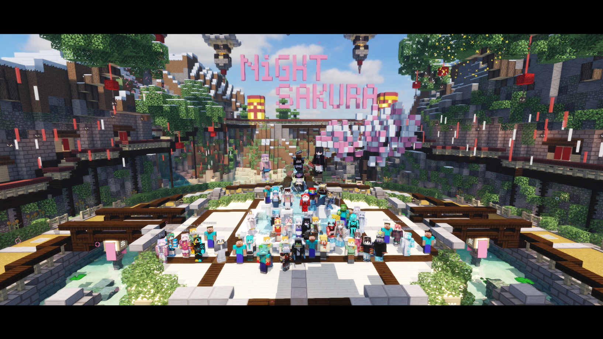
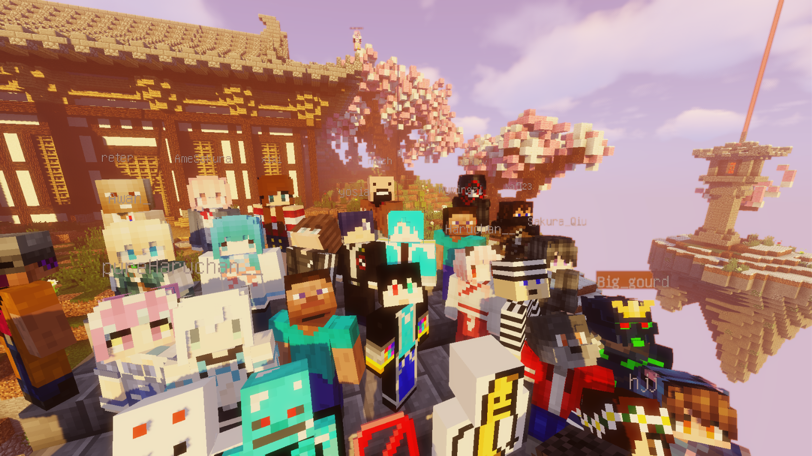
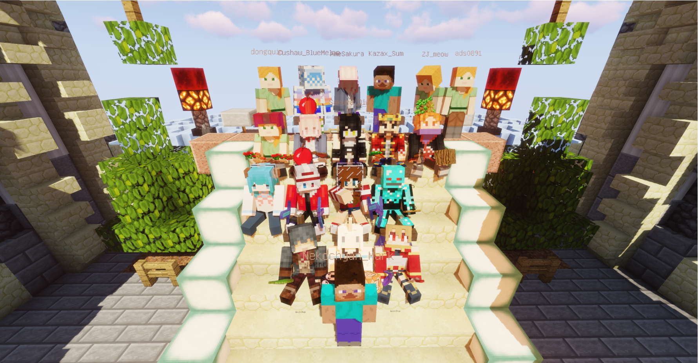

# 🌸夜下の桜🌸

**欢迎来到 夜桜社Minecraft服务器**

## 夜桜背景

一批热爱Minecraft的人们因为种种原因聚在了一起。

他们怀着梦想，营造了夜桜社。

每一位到来的新玩家都成为了夜桜社的住民。

一同创造着属于自己与夜桜社的故事。

## 夜桜历史

### 一周目（待考据）

（2019/1/27 以前）

### 二周目（待考据）

（2019/1/27 以前）

### 三周目（待考据）

（2019/1/27 以前）

### 四周目

于2019年1月27日 2:00 准时开启，并设置为不再更换周目。

#### 播种之桜

（2019/1/27 - 2020/1/26）  

- 2019/1/27 夜桜社四周目正式开启并步入1.13.2版本。
- 2019/2/4 夜桜社2019年新年合影。
- 2019/5/11 开启1.14创造服务器，用于征集优秀建筑。
    - 原定会挑选优秀建筑作为新主城，但似乎并没有落地。
    - ~~NightSakura 第一届建筑大赛~~
- 2019/6/13 夜桜管理组变动，管理***Ciac*** `Cecilia_Schariac` 因多次滥用权限，试图破坏夜桜社的友好秩序被封禁。
    - 同时住民***天姫*** `Tenkijino` 作为受害人，受管理***Sakura*** `AmeSakura` 推荐并自发请愿，就任夜桜管理一职。
- 2019/6/19 夜桜社主城系统商店进行重新装修，服务器步入1.14.2版本，展开掠夺吧！
    - 1.14.2版本开始服务器进入性能危机。
    - 刚步入1.14.2版本的一小段时间内夜桜社出现**怪物暴走**异变，各类怪物如同潮水般刷新，使住民们连连叫苦，届时也有很多住民因为这场异变离开了夜桜社。
    - **怪物暴走**异变很快就被解决了。
- 2019/7/15 夜桜服主***Mark*** `MoeMark` 开启夜桜社一周年活动。
    - 本次活动开展了鞘翅飞行与~~跑酷~~。
    - 因为性能原因鞘翅飞行的奖品迟迟没能下发（至今）。
    - 跑酷活动因性能原因被迫停止。
- 2019/7/16 夜桜社[二期宣传片](https://www.bilibili.com/video/av59467430)正式推出。
    - 二期宣传片的封面设计在制作时收到了***天姫*** `Tenkijino` 与 ***Sakura*** `AmeSakura` 的大量吐槽
- 2019/7/20 服务器步入1.14.4版本，四重保护防具没法再生产啦！
    - 更新后的几小时内出现了**生物隐形**事件，很快被解决了。
- 2019/8/3 八重村城下町区域竣工，作为PVP场向玩家开放。
- 2019/8/13 因新版本的性能堪忧，外加部分住民对生产机器的过度开发导致服务器TPS日均低下，夜桜管理组对此进行了新规颁布与部分特性废除。
- 2019/8/28 夜桜社一周年合影。
- 2019/11/1 2019年万圣节活动。
- 2020/1/24 夜桜社2020年春节合影。

（更多内容待考据）

#### 萌发之桜

（2020/1/26 - 至今）

- 2020/1/26 生存世界出生点更换，原坐标`(-33,66,15)`更换至`(-5123,67,-1432)`。
    - 新出生点为一座神社配备小型祭典市场。
    - 然而这个小市场只在更新时有一小段时间人气。
    - 并不是换了生存世界啊！！
    - 同一天夜，发生了**m镇变故**。
- 2020/1/28 **m镇变故**落幕，相关住民均被封禁处理。
    - 部分相关住民在事故发生过程中对夜桜管理组频繁骚扰，进行攻击。
    - 管理***Sakura*** `AmeSakura` 因不堪大量网络攻击，更换账户，现为 `ItsMiku_`。
    - 管理***天姫*** `Tenkijino` 于 2020/4/5 与事故中已被封禁相关住民 `Fiend_Rain` 交流得知，对于当时发起网络攻击的人，`Fiend_Rain` 本人表示并不知晓。
    - 住民 `Fiend_Rain` 在交流后被解除封禁，并回到夜桜社回顾了**m镇**。
    - 当时对管理组发起网络攻击的人员依然未能找到。
- 2020/2/5 **八重村**完全建成，并发布[视频](https://www.bilibili.com/video/BV1d7411p7GB)在Bilibili。
    - 随后有部分住民希望建筑者***天姫*** `Tenkijino`修建**天命总部**。
    - ~~建筑者表示有空会修的~~。
- 2020/2/8 **绯桜世界**显现，强大的精英怪与新道具的引入让住民们进入了战斗模式。
- 2020/2/12 受疫情影响，夜桜社开展了**[战“疫”活动](https://www.9sakura.com/%e6%88%98%e7%96%ab%e6%b4%bb%e5%8a%a8.html)**。
- 2020/2/18 夜桜铁路投入建设，始发站在生存世界出生点，由管理***天姫*** `Tenkijino`发起。
    - 铁路建设缓慢。
    - ~~几乎咕了~~。
- 2020/3/9 夜桜社新主城上线。
    - 上线日许多住民表示路太绕了。
- 2020/3/10 夜桜岛玩家商店街投入使用。
    - 短时间内22个门面均被占满。
    - 部分住民表示店铺量太少了。
- 2020/4/1 夜桜岛玩家商店街新增两条店铺街并新增了全球市场。
    - 然后全球市场坏了。
- 2020/4/14 换了新的全球市场，系统经济发生了变化。
- 2020/4/26 **绯桜之染Beta**结束，绯桜世界暂时从夜桜社消失，世界回到和平
- 2020/5/1 开展劳动节违章建筑活动
    - ~~夜桜第二届建筑大赛~~
    - 夜桜第一届建筑大赛
    - 说好的三个柱子有一个被扬了
    - 活动服保留下来作为创造服
- 2020/5/4 一批斗志高昂的住民集结参战**毛玉线圈物语&喵窝**的【Adventurer Legends | 职业死斗】活动
    - 分为两支队伍，分别由管理**Sakura** `ItsMiku_` 与**天姫** `Tenkijino`带领参战
    - ***Sakura*** `ItsMiku_`带领的队伍取得了更好的成绩
    - 对于本次参战住民均发放了联动纪念品
- 2020/7/11 **绯桜之染1.0**开设，继续战斗的旅程！
    - 采用了全新的战斗机制与道具获取机制
    - ~~我的装备又附魔附爆了！！~~
    - 使用了自定义材质，让道具们更具多样化！
- 2020/8/16-18 夜桜社二周年！
    - 鞘翅飞行二期，过于~~阴间~~的赛道让住民们纷纷吐槽赛道修建者
    - 跑酷活动！使用HeilKle制作的Parkour Paradise 2地图，赛道之长之坑让选图者都难以通过
        - ~~欢迎回到快乐老家~~（指46与47关）
    - CSGO水友赛，分为三支队伍进行竞技比拼
        - 二队连败，队长`ShowT1me_Alan`表示：带不动，真带不动
        - 最后的胜出队伍为服主`MeowMark`带领的一队
- 2020/8/27 在漫长的等待下，夜桜社迎来的全新的下界！
    - 服务器版本更新至1.16.2
    - 开设两个下界世界，其中的生存下界与生存主世界连通且不会刷新！
    
## 住民留影

### 2020年春节合影

### 2019年春节合影

### 三周目合影

*更多待补充...*
