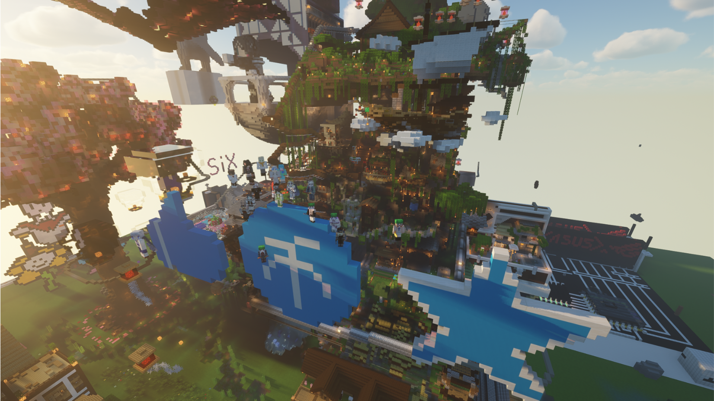

# 往期活动

!> 因为大量记录缺失因此本页面并不完整。

这里记录了夜桜社的往期活动。

## 2020 劳动节违章建筑活动

于2020年5月1日至5月3日晚8：00

玩家在几个预设方块的场地上自由发挥。

每日参与建设的玩家发放：
- 耐久10与效率10的钻石工具一套

对于建设中突出的玩家发放：
- 效率10无法破坏钻石工具一套（共两人）
分别是：`404Prime`，`Kuriyama_Mirai__`

对于建设中较为突出的玩家发放：
- 效率10耐久10且包含经验修复的钻石工具一套（共六人）
分别是： `Read_you`，`Sayoko_O3O`，`Serendipity77`，`XHETXIEE`，`Wu_Momo`，`kokobird`

感谢每一位参与建设的玩家！

### 合影：

## 2020 战“疫”活动

于2020年2月15日晚8:30举行

合力抗击“疫情”，活动介绍页面：[战“疫”活动](https://www.9sakura.com/%e6%88%98%e7%96%ab%e6%b4%bb%e5%8a%a8.html)

## 2019 夜桜社一周年活动

（待补）
