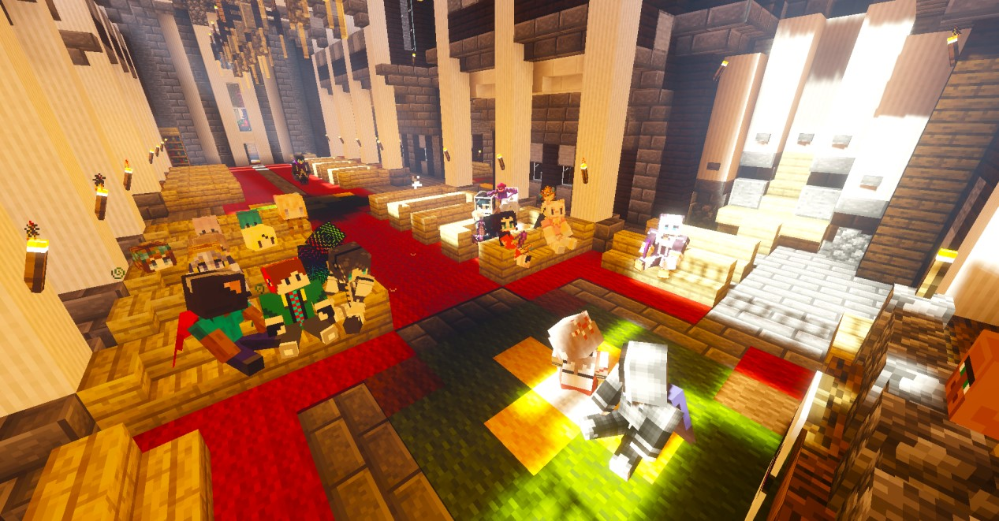
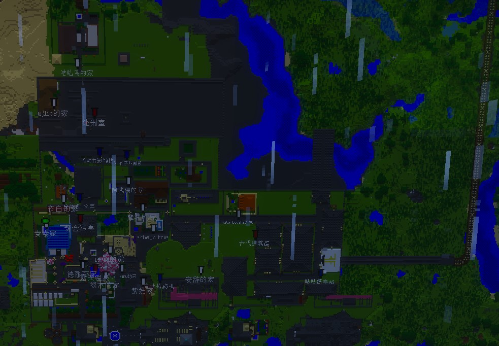
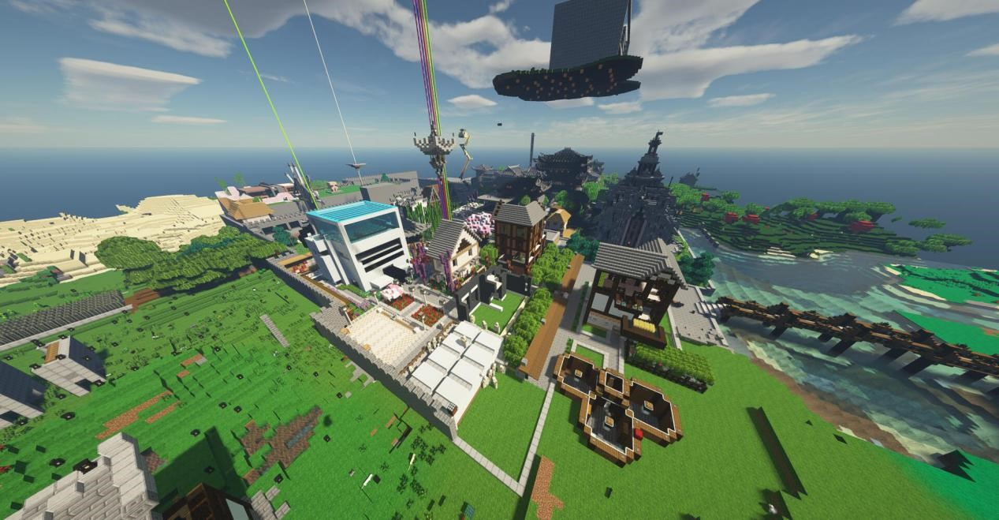
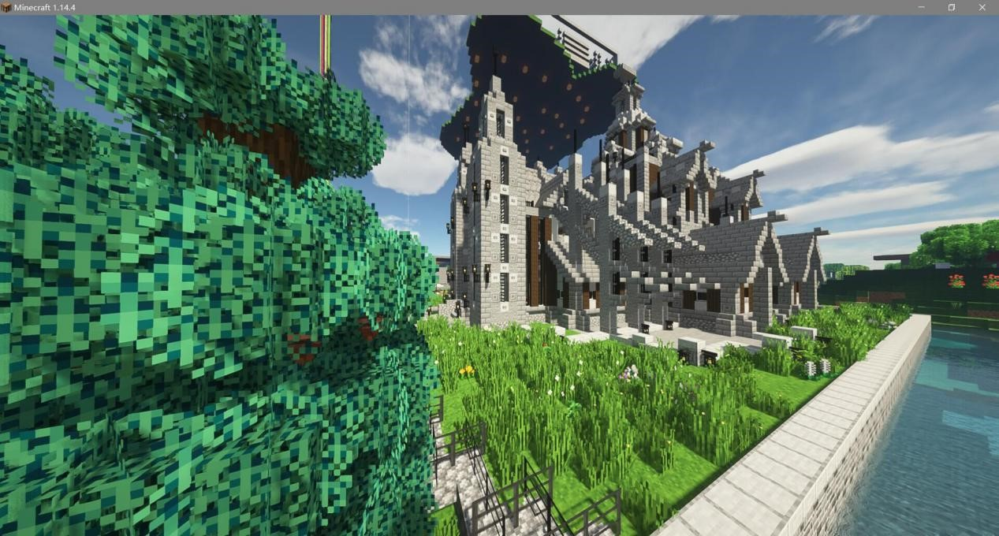
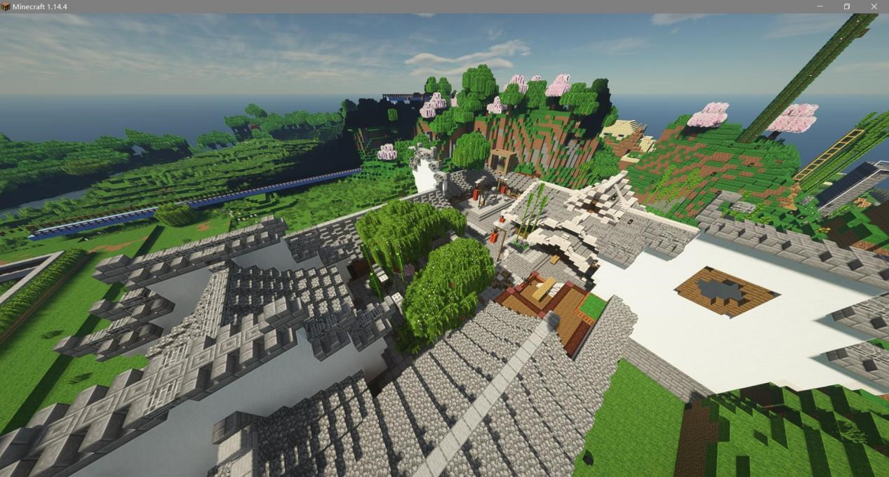
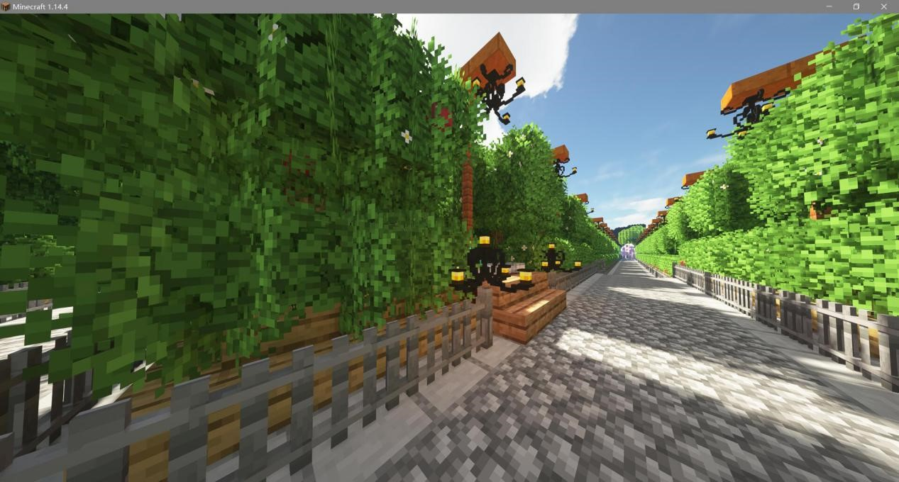

# 咕咕镇

?> ✔️一个合法咕咕咕的小镇。

本镇不会要求太多，只要会玩就行。  
建筑风格随意，类型随意，开心就好awa。  
无论你是红石带老  
还是建筑师  
或是一个单纯游戏热爱者  
我们都欢迎你的到来  

## 入驻要求

1. 可以咕咕咕，但是尽量别加入就退服了。XD
2. 拥有10w+的资产。（领地价值也算）
    - 咕咕镇不会征用任何成员的私人财产，设置资金门槛的目的是筛选玩家（毕竟10w还是不太难赚的）。  
      如果有建筑或者红石方面的特长（会就算）可以酌情降低门槛qwq。  
3. 保持高素质，不惹事，遇到矛盾找小奏或者op，不要当众对线当封号斗罗（小奏：因为我心疼你们啊qwq）。

镇长：*立华奏* `Itskanade`  
副镇长：*德丽莎* `SAD_os`  
镇长QQ：`897415706`  
小镇QQ群：`955399035`  

## 镇员合影

## 小镇风景

### 小镇地图

### 小镇全景

### 国风建筑群

建筑: *安辞* `XYanwa`

### 大教堂

建筑: *哆啦* `Ylaord`

### 大院

建筑: *精明小绿* `ShrewdWU`

### 小路（工事中）

建筑: *立华奏* `ItsKanade`

## 镇员留言

咕咕镇的大门，向每一个热爱mc的玩家敞开XD

**下面是小镇成员们的留言**

*立华奏*`Itskanade`：
其实我从一开始也没想到我居然会建设了一个小镇，和镇员们嗨皮的回忆，对我来说，是一笔宝贵的财富。  
我希望当你们咕够了的时候，我能对你们说一句：欢迎来到咕咕镇XD

*德丽莎*`SAD_oS`：
大爱我家咕咕奏awa

*冰鱼*：
养老首选咕咕镇，圈地有补贴，建房有补贴，干啥都有补贴，真是一个好小镇，真是一个好镇长(小奏：以上内容游戏正文不会出现) 

*咕咕蓝*`NstzJ`：
来咕咕镇可以领会到咕咕咕的精髓。

*影捷*`yingjie123`：
奏是大佬，整天欺负我

*皇冥镇内鬼*：
奏是大佬，特别喜欢女装（小奏：你fp）

*咕咕草*：
~~团结，有爱，互助，进步~~

`Deft_m`：
芜湖！ 咕咕镇 真tm咕

*夜白*：
咕咕咕~

*咕咕鸟*：
咕咕镇建筑很多，风格也挺丰富，看起来十分繁荣，加镇子没啥特别要求，也不会被抓去当工具人。 

